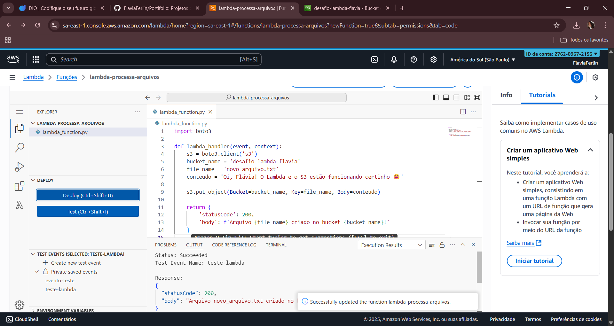
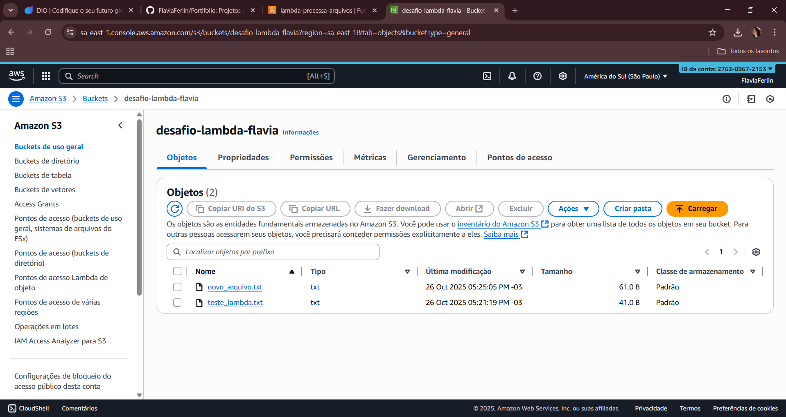

# 🧩 Desafio DIO - Executando Tarefas Automatizadas com Lambda Function e S3

## 📚 Descrição do Projeto
Este projeto foi desenvolvido como parte do curso da **Digital Innovation One (DIO)**, com o objetivo de consolidar os conhecimentos em **AWS Lambda** e **Amazon S3**, criando uma função serverless em Python que interage com o bucket de armazenamento.

---

## 🛠️ Tecnologias Utilizadas
- **AWS Lambda**
- **Amazon S3**
- **Python (boto3)**
- **AWS Console**

---

## 🚀 Etapas Realizadas

## 1️⃣ Criação do Bucket S3
**Nome do bucket:** `desafio-lambda-flavia`  
**Região:** `sa-east-1 (São Paulo)`


---

## 2️⃣ Criação da Função Lambda (Python)


---

## 3️⃣ Teste da Função Lambda


---

## 4️⃣ Execução do S3


---

### 2️⃣ Criação da Função Lambda (Python)
Função responsável por criar e enviar arquivos automaticamente para o S3.

```python
import boto3

def lambda_handler(event, context):
    s3 = boto3.client('s3')
    bucket_name = 'desafio-lambda-flavia'
    file_name = 'novo_arquivo.txt'
    conteudo = 'Oi, Flávia! O Lambda e o S3 estão funcionando certinho 😊'

    s3.put_object(Bucket=bucket_name, Key=file_name, Body=conteudo)

    return {
        'statusCode': 200,
   'body': f'Arquivo {file_name} criado no bucket {bucket_name}!'
    }

---

3️⃣ Execução do Teste da Função Lambda

Evento de teste: teste-lambda

Status: ✅ Succeeded

---

4️⃣ Verificação dos Arquivos no S3

Os arquivos foram criados com sucesso no bucket após a execução da função.

---

🧠 Aprendizados

Durante este desafio, aprimorei o entendimento sobre:

Integração entre AWS Lambda e S3;

Automação de tarefas serverless;

Utilização do boto3 em Python;

Estruturação e documentação de projetos técnicos com GitHub.

---

✨ Autora

Flávia Ferlin
📍 Projeto desenvolvido para o Bootcamp Santander Code Girls 2025 - DIO
